# Hotel Booking App - Flutter Practice
- TimeLine: 06/08/2025 - 31/08/2025
- Figma : [link](https://www.figma.com/design/nzprKFBUGynpvB8ajK3DIU/Grand-Hotel---Hotel-Booking-App-Ui-Kits--Simplifies-hotel-bookings-with-a-few-clicks---Community-?node-id=32162-2785&m=dev&t=x60u1swFy0KEC216-1)
- Project structure: MVVM (Model-View-View Model)

## Targets
- Have an understanding a UIs & Layouts
- Be able to debug (with simulator & physical device) & and develop with some available tools from recommendation.
- Responsive & Theme
- Basic State Management & Storages
  
## Test Accounts
- User test 1 : 
  - Email: daothikhuyen30@gmail.com 
  - Password: Daothikhuyen30@
  
## Function
- Login
- Home ( search by text or search by filter)
- Hotel Booking (Select date, number of guests)
- View your booked rooms, booking history
- Profile( change language and update personal info)
- Logout

## UI: Hotel Booking App

- **OnBoarding and Splash**
  
   

- **Login**
  
 

- **Home**

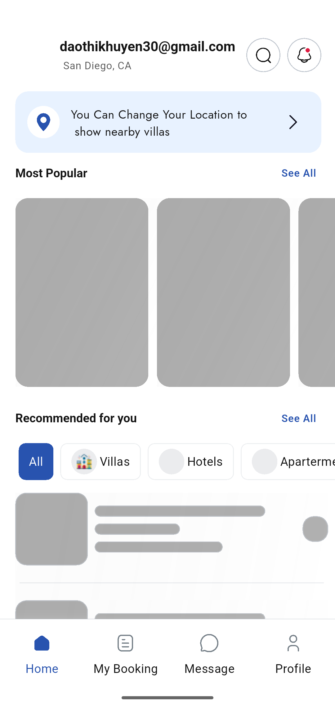   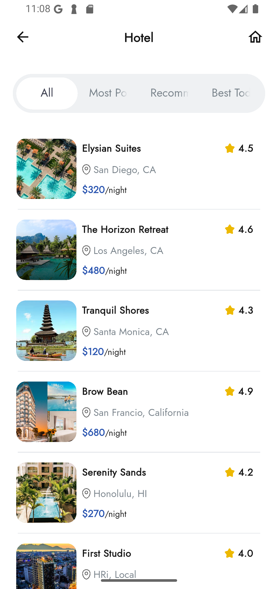 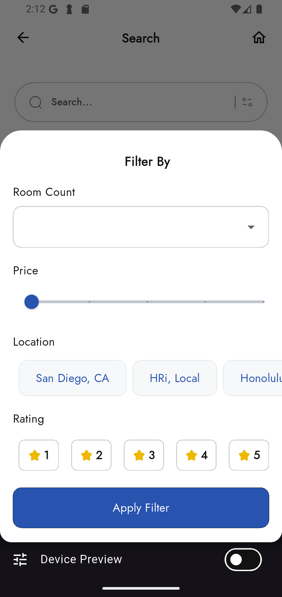 

- **Detail**

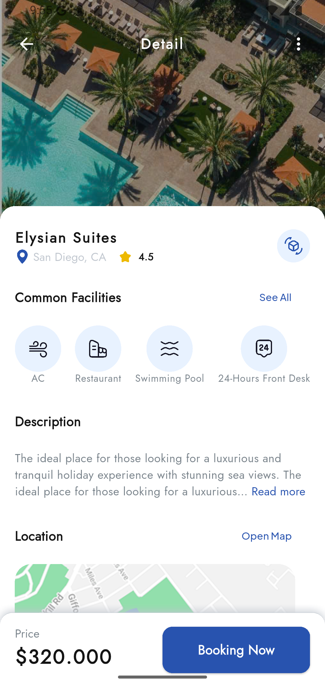  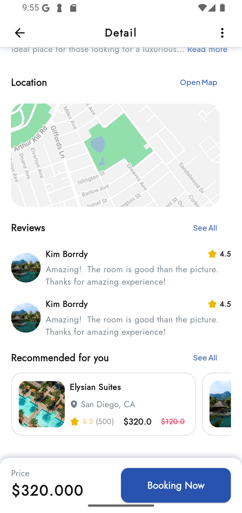 

- **Request to book**

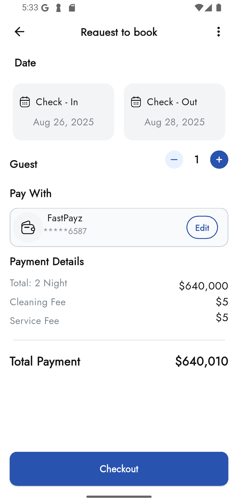  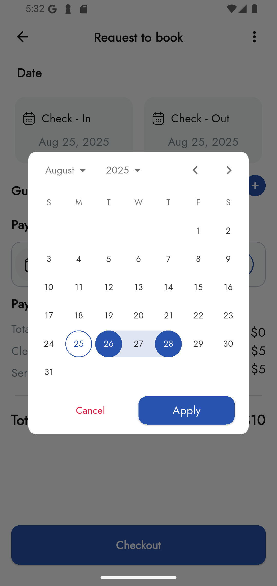  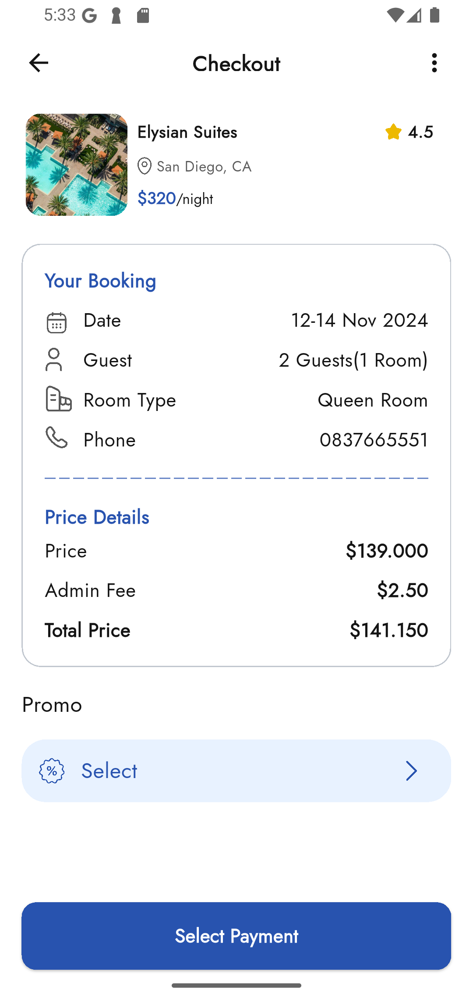  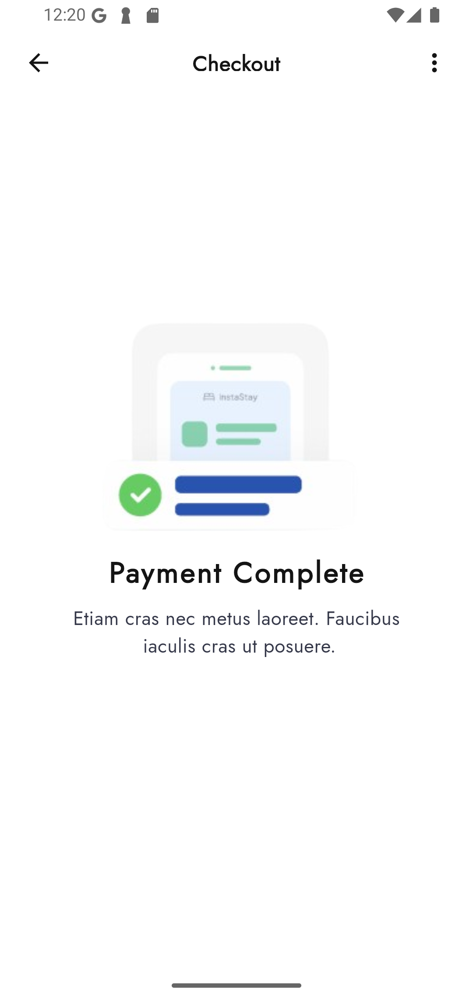 

- **My booking**
  
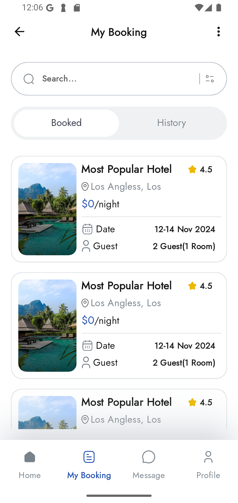 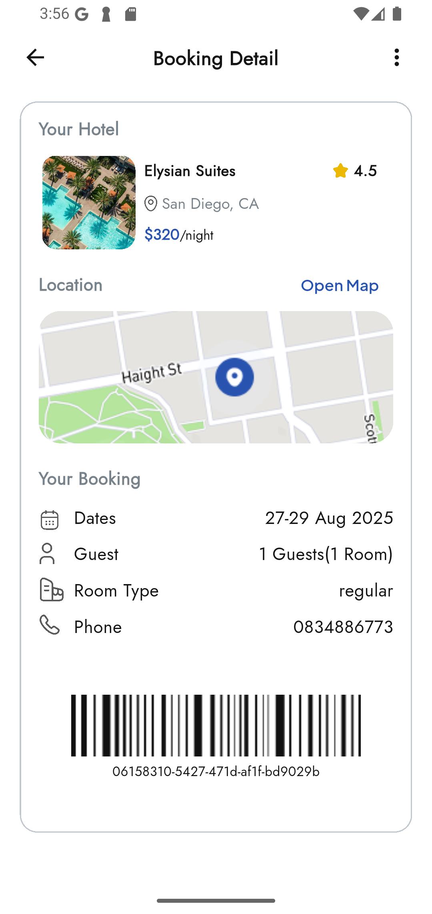 

- **Profile**

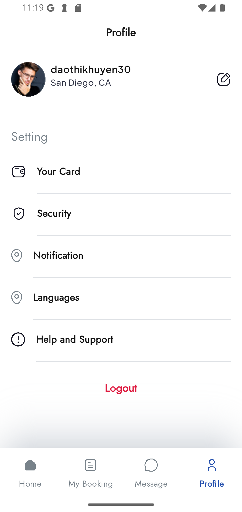 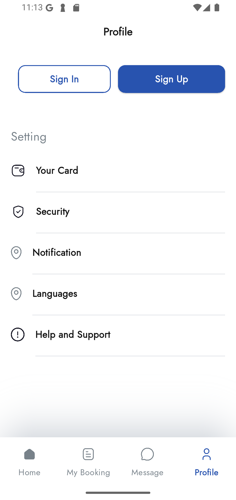 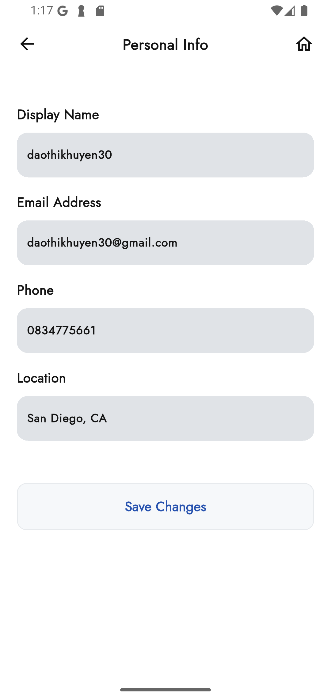  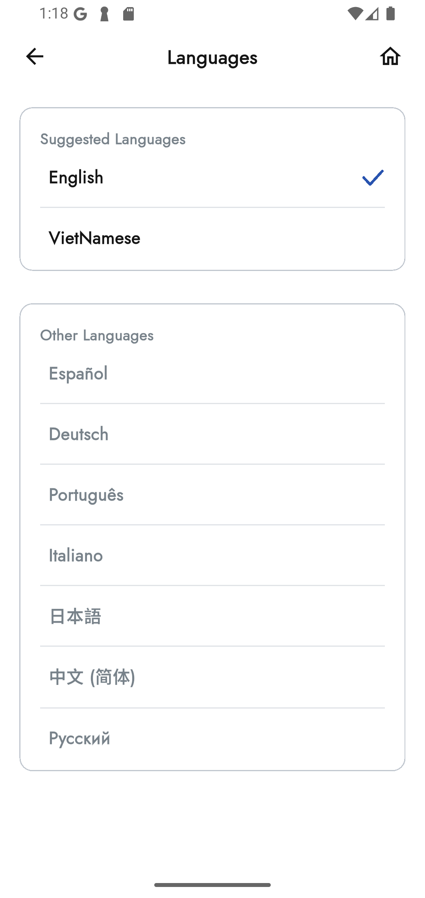 

- **Demo**
  
    [Video demo hotel booking app](https://github.com/user-attachments/assets/caf4c5c1-3c8c-4da1-9d77-cbaf97ecb69e)

    [Video demo widgetbook](https://github.com/user-attachments/assets/53b1dbc7-a926-47f1-9532-716e29fb37ef)

## Technologies Used
- Visual studio code
- Dart (v3.7.0)
- Flutter (v3.29.0)
- DevTools (v2.42.2)

## Installation

- Set up flutter gen: [See more here](https://pub.dev/packages/flutter_gen)
```bash
  dart pub global activate flutter_gen
```
- User flutter gen 
```bash
  flutter pub run build_runner build --delete-conflicting-outputs
```
- Set up multi language: [See more here](https://docs.flutter.dev/ui/accessibility-and-internationalization/internationalization)

```bash
  flutter pub add flutter_localizations --sdk=flutter
  flutter pub add intl:any
```
### Run Widgetbook

- Built file main.directories.g in widgetbook
  
```bash
  flutter pub run build_runner build
```

- Run widgetbook
```bash
  B1: cd widgetbook
  B2: flutter run
```

### Run Hotel Booking App 
- Move to project branch

```bash
    git checkout master
```
- Run project
```bash
  flutter run
```

