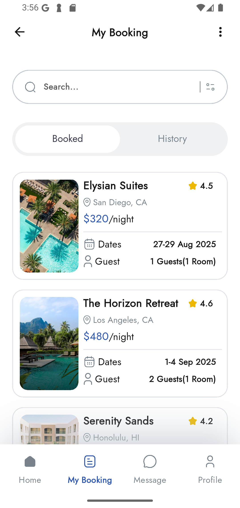

# Hotel Booking App - Flutter Practice
- TimeLine: 06/08/2025 - 
- Figma : [link](https://www.figma.com/design/nzprKFBUGynpvB8ajK3DIU/Grand-Hotel---Hotel-Booking-App-Ui-Kits--Simplifies-hotel-bookings-with-a-few-clicks---Community-?node-id=32162-2785&m=dev&t=x60u1swFy0KEC216-1)

## Targets
- Have an understanding a UIs & Layouts
- Be able to debug (with simulator & physical device) & and develop with some available tools from recommendation.
- Responsive & Theme
- Basic State Management & Storages

## UI: Hotel Booking App

- **OnBoarding and Splash**
  
   

- **Login**
  
 

- **Home**

   

- **Detail**

   

- **Request to book**

       

- **My booking**
  
 


- **Demo**
https://github.com/user-attachments/assets/d1e7f3c0-3862-4cfc-9002-8e79a6e69f6d

## Technologies Used
- Visual studio code
- Dart (v3.7.0)
- Flutter (v3.29.0)
- DevTools (v2.42.2)

## Installation

- Set up flutter gen: [See more here](https://pub.dev/packages/flutter_gen)
```bash
  dart pub global activate flutter_gen
```
- Add build_runner and FlutterGen to your package's pubspec.yaml file:
```bash
  dev_dependencies:
  build_runner:
  flutter_gen_runner:
```
- User flutter gen 
```bash
  flutter pub run build_runner build --delete-conflicting-outputs
```
- Set up multi language: [See more here](https://docs.flutter.dev/ui/accessibility-and-internationalization/internationalization)

```bash
  flutter pub add flutter_localizations --sdk=flutter
  flutter pub add intl:any
```
### Run Widgetbook

- Set up Widgetbook project: [See more her](https://docs.widgetbook.io/guides/quick-start)
```bash
  flutter create widgetbook --empty
  flutter create widgetbook --empty --platforms=web,macos
```
- Built file main.directories.g in widgetbook
  
```bash
  flutter pub run build_runner build
```

- Move to folder
```bash
  cd widgetbook
```

- Run project
```bash
  flutter run
```
### Run Hotel Booking App 
- Move to project branch

```bash
    git checkout master
```
- Run project
```bash
  flutter run
```

